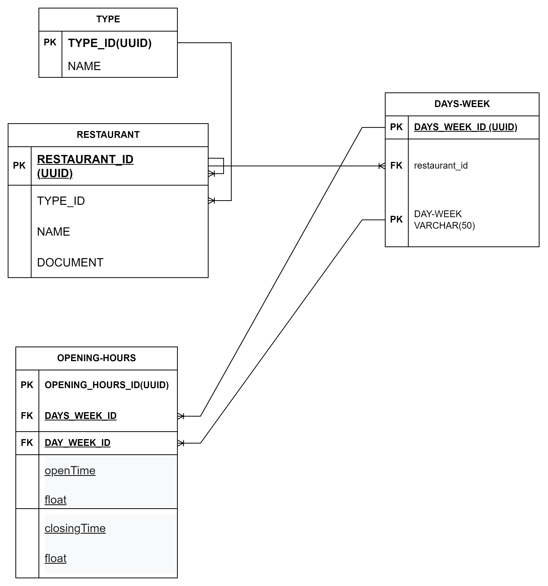

# restaurant-system-api

## Tabela de Conteúdos

- [Visão Geral](#1-visão-geral)
- [Diagrama ER](#2-diagrama-er)
- [Início Rápido](#3-início-rápido)
  - [Instalando Dependências](#31-instalando-dependências)
  - [Variáveis de Ambiente](#32-variáveis-de-ambiente)
  - [Conectando Database](#33-conectando-database)

---

## 1. Visão Geral

Visão geral do projeto, um pouco das tecnologias usadas.

- [NodeJS](https://nodejs.org/en/)
- [Express](https://expressjs.com/pt-br/)
- [TypeScript](https://www.typescriptlang.org/)
- [PostgreSQL](https://www.postgresql.org/)
- [TypeORM](https://typeorm.io/)
- [Yup](https://github.com/jquense/yup)

---

## 2. Diagrama ER

[ Voltar para o topo ](#tabela-de-conteúdos)

Diagrama ER da API definindo bem as relações entre as tabelas do banco de dados.



---

## 3. Início Rápido

[ Voltar para o topo ](#tabela-de-conteúdos)

### 3.1. Instalando Dependências

Clone o projeto em sua máquina e instale as dependências com o comando:

```shell
yarn
```

### 3.2. Variáveis de Ambiente

Em seguida, crie um arquivo **.env**, copiando o formato do arquivo **.env.example**:

```
cp .env.example .env
```

Configure suas variáveis de ambiente com suas credenciais do Postgres e uma nova database da sua escolha.
**Configure as variáveis de ambiente no seu .env**, passando as credenciais corretas para conectar em seu banco local

### 3.3 Conectando database


Não esquecer de criar e rodar as migrações no seu data-base.
yarn typeorm migration:run -d src/data-source

Com isso feito, para rodar sua aplicação, basta utilizar o comando

```
yarn dev
```
```
